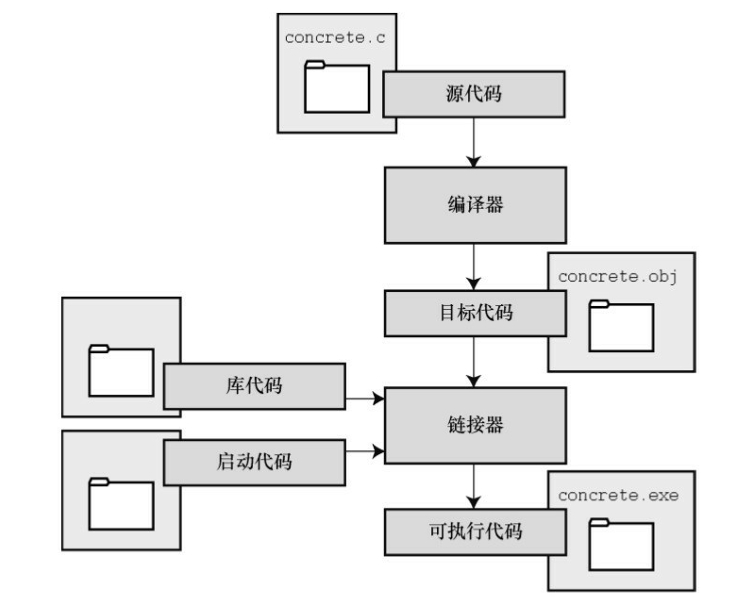

### 1.7 使用C语言的7个步骤
#### 1 定义程序的目标
#### 2 设计程序
#### 3 编写代码 
#### 4 编译
#### 5 运行程序
#### 6 测试和调试程序
#### 7 维护和修改程序
<ins>**在动手写程序之前，要在脑中有清晰的思路。想要程序去做什么首先自
己要明确自己想做什么，思考你的程序需要哪些信息，要进行哪些计算和控
制，以及程序应该要报告什么信息。在这一步骤中，不涉及具体的计算机语
言，应该用一般术语来描述问题**</ins>

### 1.7.2 第2步：设计程序
对程序应该完成什么任务有概念性的认识后，就应该考虑如何用程序来
完成它。例如，用户界面应该是怎样的？如何组织程序？目标用户是谁？准
备花多长时间来完成这个程序？<br>
除此之外，还要决定在程序（还可能是辅助文件）中如何表示数据，以
及用什么方法处理数据。学习C语言之初，遇到的问题都很简单，没什么可
选的。但是，随着要处理的情况越来越复杂，需要决策和考虑的方面也越来
越多。通常，选择一个合适的方式表示信息可以更容易地设计程序和处理数
据。<br>
再次强调，应该用一般术语来描述问题，而不是用具体的代码。但是，
你的某些决策可能取决于语言的特性。例如，在数据表示方面，C的程序员
就比Pascal的程序员有更多选择。<br>

### 1.7.3 第3步：编写代码
设计好程序后，就可以编写代码来实现它。也就是说，把你设计的程序
翻译成 C语言。这里是真正需要使用C语言的地方。可以把思路写在纸上，
但是最终还是要把代码输入计算机。这个过程的机制取决于编程环境，我们
稍后会详细介绍一些常见的环境。一般而言，使用文本编辑器创建源代码文
件。该文件中内容就是你翻译的C语言代码。程序清单1.1是一个C源代码的
示例。
程序清单1.1 C源代码示例<br>

```
#include <stdio.h>
int main(void)
{
int dogs;
printf("How many dogs do you have?\n");
scanf("%d", &dogs);
printf("So you have %d dog(s)!\n", dogs);
return 0;
}
```
在这一步骤中，应该给自己编写的程序添加文字注释。最简单的方式是
使用 C的注释工具在源代码中加入对代码的解释。

### 1.7.4 第4步：编译
接下来的这一步是编译源代码。再次提醒读者注意，编译的细节取决于
编程的环境，我们稍后马上介绍一些常见的编程环境。现在，先从概念的角
度讲解编译发生了什么事情。<br>
前面介绍过，编译器是把源代码转换成可执行代码的程序。可执行代码
是用计算机的机器语言表示的代码。这种语言由数字码表示的指令组成。<ins>**如
前所述，不同的计算机使用不同的机器语言方案。C 编译器负责把C代码翻
译成特定的机器语言。此外，C编译器还将源代码与C库（库中包含大量的
标准函数供用户使用，如printf()和scanf()）的代码合并成最终的程序（更精
确地说，应该是由一个被称为链接器的程序来链接库函数，但是在大多数系
统中，编译器运行链接器）。**</ins>其结果是，生成一个用户可以运行的可执行文
件，其中包含着计算机能理解的代码。
编译器还会检查C语言程序是否有效。如果C编译器发现错误，就不生
成可执行文件并报错。理解特定编译器报告的错误或警告信息是程序员要掌
握的另一项技能。

### 1.7.5 第5步：运行程序
传统上，可执行文件是可运行的程序。在常见环境（包括Windows命令
提示符模式、UNIX终端模式和Linux终端模式）中运行程序要输入可执行文
件的文件名，而其他环境可能要运行命令（如，在VAX中的VMS[2]）或一
些其他机制。例如，在Windows和Macintosh提供的集成开发环境（IDE）
中，用户可以在IDE中通过选择菜单中的选项或按下特殊键来编辑和执行C
程序。最终生成的程序可通过单击或双击文件名或图标直接在操作系统中运
行。

### 1.7.6 测试和调试程序
将来犯错的机会很多。你可能会犯基本的设计错误，可能错误地实现了
一个好想法，可能忽视了输入检查导致程序瘫痪，可能会把圆括号放错地
方，可能误用 C语言或打错字，等等。把你将来犯错的地方列出来，这份错
误列表应该会很长。

### 1.7.7 维护和修改代码
创建完程序后，你发现程序有错，或者想扩展程序的用途，这时就要修
改程序。例如，用户输入以Zz开头的姓名时程序出现错误、你想到了一个更
好的解决方案、想添加一个更好的新特性，或者要修改程序使其能在不同的
计算机系统中运行，等等。如果在编写程序时清楚地做了注释并采用了合理
的设计方案，这些事情都很简单。

### 1.7.8 注释
编程并非像描述那样是一个线性的过程。有时，要在不同的步骤之间往
复。例如，在写代码时发现之前的设计不切实际，或者想到了一个更好的解
决方案，或者等程序运行后，想改变原来的设计思路。对程序做文字注释为
今后的修改提供了方便。

许多初学者经常忽略第1步和第2步（定义程序目标和设计程序），直接
跳到第3步（编写代码）。刚开始学习时，编写的程序非常简单，完全可以
在脑中构思好整个过程。即使写错了，也很容易发现。但是，随着编写的程
序越来越庞大、越来越复杂，动脑不动手可不行，而且程序中隐藏的错误也
越来越难找。最终，那些跳过前两个步骤的人往往浪费了更多的时间，因为
他们写出的程序难看、缺乏条理、让人难以理解。要编写的程序越大越复
杂，事先定义和设计程序环节的工作量就越大。

磨刀不误砍柴工，应该养成先规划再动手编写代码的好习惯，用纸和笔
记录下程序的目标和设计框架。这样在编写代码的过程中会更加得心应手、
条理清晰。

### 1.8 编程机制
生成程序的具体过程因计算机环境而异。C是可移植性语言，因此可以
在许多环境中使用，包括UNIX、Linux、MS-DOS（一些人仍在使用）、
Windows和Macintosh OS。有些产品会随着时间的推移发生演变或被取代，
本书无法涵盖所有环境。

首先，来看看许多C环境（包括上面提到的5种环境）共有的一些方
面。虽然不必详细了解计算机内部如何运行C程序，但是，了解一下编程机
制不仅能丰富编程相关的背景知识，还有助于理解为何要经过一些特殊的步
骤才能得到C程序。

用C语言编写程序时，编写的内容被储存在文本文件中，该文件被称为
源代码文件（source code file）。大部分C系统，包括之前提到的，都要求文
件名以.c结尾（如，wordcount.c和budget.c）。在文件名中，点号（.）前面
的部分称为基本名（basename），点号后面的部分称为扩展名
（extension）。因此，budget是基本名，c是扩展名。基本名与扩展名的组合
（budget.c）就是文件名。文件名应该满足特定计算机操作系统的特殊要
求。例如，MS-DOS是IBM PC及其兼容机的操作系统，比较老旧，它要求基
本名不能超过8个字符。因此，刚才提到的文件名wordcount.c就是无效的
DOS文件名。有些UNIX系统限制整个文件名（包括扩展名）不超过14个字
符，而有些UNIX系统则允许使用更长的文件名，最多255个字符。Linux、
Windows和Macintosh OS都允许使用长文件名。

接下来，我们来看一下具体的应用，假设有一个名为concrete.c的源文
件，其中的C源代码如程序清单1.2所示。<br>
程序清单1.2 c程序<br>
```
#include <stdio.h>
int main(void)
{
printf("Concrete contains gravel and cement.n\");
return 0;
}
```
### 1.8.1 目标代码文件、可执行文件和库   
<ins>**C编程的基本策略是，用程序把源代码文件转换为可执行文件（其中包
含可直接运行的机器语言代码）。典型的C实现通过编译和链接两个步骤来
完成这一过程。编译器把源代码转换成中间代码，链接器把中间代码和其他
代码合并，生成可执行文件。**</ins> C 使用这种分而治之的方法方便对程序进行模
块化，可以独立编译单独的模块，稍后再用链接器合并已编译的模块。通过
这种方式，如果只更改某个模块，不必因此重新编译其他模块。另外，链接
器还将你编写的程序和预编译的库代码合并。

中间文件有多种形式。我们在这里描述的是最普遍的一种形式，即把源
代码转换为机器语言代码，并把结果放在目标代码文件（或简称目标文件）
中（这里假设源代码只有一个文件）。虽然目标文件中包含机器语言代码，
但是并不能直接运行该文件。因为目标文件中储存的是编译器翻译的源代
码，这还不是一个完整的程序。

目标代码文件缺失启动代码（startup code）。启动代码充当着程序和操
作系统之间的接口。例如，可以在MS Windows或Linux系统下运行IBM PC兼
容机。这两种情况所使用的硬件相同，所以目标代码相同，但是Windows和
Linux所需的启动代码不同，因为这些系统处理程序的方式不同。

目标代码还缺少库函数。几乎所有的C程序都要使用C标准库中的函
数。例如，concrete.c中就使用了 printf()函数。目标代码文件并
不包含该函数的代码，它只包含了使用 printf()函数的指令。
printf()函数真正的代码储存在另一个被称为库的文件中。库文件中有许多函数的目标代码。

链接器的作用是，把你编写的目标代码、系统的标准启动代码和库代码
这 3 部分合并成一个文件，即可执行文件。对于库代码，链接器只会把程序
中要用到的库函数代码提取出来.



简而言之，目标文件和可执行文件都由机器语言指令组成的。然而，目
标文件中只包含编译器为你编写的代码翻译的机器语言代码，可执行文件中
还包含你编写的程序中使用的库函数和启动代码的机器代码。

在有些系统中，必须分别运行编译程序和链接程序，而在另一些系统
中，编译器会自动启动链接器，用户只需给出编译命令即可。
