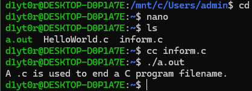
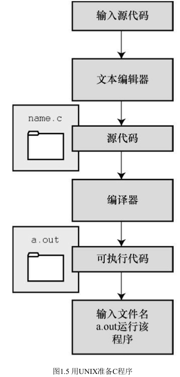

### 1.8.2 UNIX系统

由于C语言因UNIX系统而生，也因此而流行，所以我们从UNIX系统开
始（注意：我们提到的UNIX还包含其他系统，如FreeBSD，它是UNIX的一
个分支，但是由于法律原因不使用该名称）。

#### 1.在UNIX系统上编辑

UNIX-C 没有自己的编辑器，但是可以使用通用的UNIX编辑器，
如emacs、jove、vi或X Window System文本编辑器。
作为程序员，要负责输入正确的程序和为储存该程序的文件起一个合适
的文件名。如前所述，文件名应该以.c结尾。注意，UNIX区分大小写。因
此，budget.c、BUDGET.c和Budget.c是3个不同但都有效的C源文件名。但是
BUDGET.C是无效文件名，因为该名称的扩展名使用了大写C而不是小写c。

假设我们在vi编译器中编写了下面的程序，并将其储存在inform.c文件中：
```
#include　<stdio.h>
 int　main(void)
 {
 printf("A　.c　is　used　to　end　a　C　program　filename.\n");
 return　0;
 }
```
以上文本就是源代码，inform.c是源文件。注意，源文件是整个编译过
程的开始，不是结束。

#### 2.在UNIX系统上编译

***虽然在我们看来，程序完美无缺，但是对计算机而言，这是一堆乱码。
计算机不明白 #include 和 printf 是什么（也许你现在也不明白，但是学到后面
就会明白，而计算机却不会）。如前所述，我们需要编译器将我们编写的代
码（源代码）翻译成计算机能看懂的代码（机器代码）。最后生成的可执行
文件中包含计算机要完成任务所需的所有机器代码。***
以前，UNIX C 编译器要调用语言定义的 cc 命令。但是，它没有跟上标
准发展的脚步，已经退出了历史舞台。但是，UNIX系统提供的C编译器通常
来自一些其他源，然后以cc命令作为编译器的别名。因此，虽然在不同的系
统中会调用不同的编译器，但用户仍可以继续使用相同的命令。
编译inform.c，要输入以下命令：

```cc inform.c```

几秒钟后，会返回 UNIX 的提示，告诉用户任务已完成。如果程序编写
错误，你可能会看到警告或错误消息，但我们先假设编写的程序完全正确
（如果编译器报告void的错误，说明你的系统未更新成ANSI C编译器，只需
删除void即可）。如果使用ls命令列出文件，会发现有一个a.out文件（见图
1.5）。该文件是包含已翻译（或已编译）程序的可执行文件。要运行该文
件，只需输入：

```a.out```
a.out Assembler OUTput
输出内容如下：

```A .c is used to end a C program filename.```





***如果要储存可执行文件（a.out），应该把它重命名。否则，该文件会被
下一次编译程序时生成的新a.out文件替换。*** <br>

如何处理目标代码？C 编译器会创建一个与源代码基本名相同的目标代
码文件，但是其扩展名是.o。在该例中，目标代码文件是 inform.o。然而，
却找不到这个文件，因为一旦链接器生成了完整的可执行程序，就会将其删
除。如果原始程序有多个源代码文件，则保留目标代码文件。学到后面多文
件程序时，你会明白到这样做的好处。

### 1.8.3 GNU 编译器集合和 LLVM 项目

***GNU 项目始于1987年，是一个开发大量免费 UNIX 软件的集合（GNU的
意思是“ GNU’s Not UNIX ”，即 GNU 不是 UNIX）。GNU编译器集合 
GNU Compiler Collection（也被称为GCC，其中包含GCC C编译器）***
是该项目的产品之一。GCC在一个指导委员会的带领下，
持续不断地开发，它的C编译器紧跟C标准的改动。GCC有
各种版本以适应不同的硬件平台和操作系统，包括UNIX、Linux和
Windows。<ins>用gcc命令便可调用GCC C编译器。许多使用gcc的系统都用cc作
为gcc的别名。</ins>

LLVM 项目成为cc的另一个替代品。该项目是与编译器相关的开源软件
集合，始于伊利诺伊大学的2000份研究项目。它的 Clang编译器处理 C代
码，可以通过 clang调用。有多种版本供不同的平台使用，包括Linux。2012
年，Clang成为FreeBSD的默认C编译器。Clang也对最新的C标准支持得很
好。<br>

GNU和LLVM都可以使用```-v or --version```选项来显示版本信息，因此各系统都使用cc
别名来代替gcc或clang命令。以下组合：<br>

```cc -v```

<br>显示你所使用的编译器及其版本。<br>
gcc和clang命令都可以根据不同的版本选择运行时选项来调用不同C标
准。

GCC最基本的用法是：gcc [options] [filenames]，其中options是所需的参
数，filenames是文件名。
```
gcc -std=c99 inform.c
gcc　-std=c1x　inform.c
gcc　-std=c11　inform.c
```
第1行调用C99标准，第2行调用GCC接受C11之前的草案标准，第3行调
用GCC接受的C11标准版本。Clang编译器在这一点上用法与GCC相同。

### 1.8.4 Linux系统
Linux是一个开源、流行、类似于UNIX的操作系统，可在不同平台（包
括PC和Mac）上运行。在Linux中准备C程序与在UNIX系统中几乎一样，不
同的是要使用GNU提供的GCC公共域C编译器。编译命令类似于：
```
gcc inform.c
```
注意，在安装Linux时，可选择是否安装GCC。如果之前没有安装
GCC，则必须安装。通常，安装过程会将cc作为gcc的别名，因此可以在命
令行中使用cc来代替gcc。
欲详细了解GCC和最新发布的版本，请访问<br>
http://www.gnu.org/software/gcc/index.html。

### 1.8.5 PC的命令行编译器
C编译器不是标准Windows软件包的一部分，因此需要从别处获取并安
装C编译器。可以从互联网免费下载 Cygwin 和 MinGW ，这样便可在PC上通
过命令行使用GCC编译器。Cygwin在自己的视窗运行，模仿Linux命令行环
境，有一行命令提示。MinGW在Windows的命令提示模式中运行。这和GCC
的最新版本一样，支持C99和C11最新的一些功能。Borland的C++编译器5.5
也可以免费下载，支持C90。

源代码文件应该是文本文件，不是字处理器文件（字处理器文件包含许
多额外的信息，如字体和格式等）。因此，要使用文本编辑器（如，
Windows Notepad）来编辑源代码。如果使用字处理器，要以文本模式另存
文件。源代码文件的扩展名应该是.c。一些字处理器会为文本文件自动添
加.txt 扩展名。如果出现这种情况，要更改文件名，把txt替换成c。

通常，C编译器生成的中间目标代码文件的扩展名是.obj（也可能是其
他扩展名）。与UNIX编译器不同，这些编译器在完成编译后通常不会删除
这些中间文件。有些编译器生成带.asm扩展名的汇编语言文件，而有些编译
器则使用自己特有的格式。

一些编译器在编译后会自动运行链接器，另一些要求用户手动运行链接
器。在可执行文件中链接的结果是，在原始的源代码基本名后面加上.exe扩
展名。例如，编译和链接concrete.c源代码文件，生成的是concrete.exe文件。
可以在命令行输入基本名来运行该程序：
```C>concrete```

### 1.8.6 集成开发环境（Windows）
许多供应商（包括微软、Embarcadero、Digital Mars）都提供Windows
下的集成开发环境，或称为IDE（目前，大多数IDE都是C和C++结合的编译
器）。可以免费下载的IDE有Microsoft Visual Studio Express和Pelles C。利用
集成开发环境可以快速开发C程序。关键是，这些IDE都内置了用于编写C程
序的编辑器。这类集成开发环境都提供了各种菜单（如，命名、保存源代码
文件、编译程序、运行程序等），用户不用离开IDE就能顺利编写、编译和
运行程序。如果编译器发现错误，会返回编辑器中，标出有错误的行号，并
简单描述情况。

初次接触Windows IDE可能会望而生畏，因为它提供了多种目标
（target），即运行程序的多种环境。例如，IDE提供了32位Windows程序、
64位Windows程序、动态链接库文件（DLL）等。许多目标都涉及Windows
图形界面。要管理这些（及其他）选择，通常要先创建一个项目
（project），以便稍后在其中添加待使用的源代码文件名。不同的产品具体
步骤不同。一般而言，首先使用【文件】菜单或【项目】菜单创建一个项
目。选择正确的项目形式非常重要。本书中的例子都是一般示例，针对在简
单的命令行环境中运行而设计。Windows IDE提供多种选择以满足用户的不
同需求。例如，Microsoft Visual Studio提供【Win32控制台应用程序】选
项。对于其他系统，查找一个诸如【DOS EXE】、【Console】或

【Character Mode】的可执行选项。选择这些模式后，将在一个类控制台窗
口中运行可执行程序。选择好正确的项目类型后，使用IDE的菜单打开一个
新的源代码文件。对于大多数产品而言，使用【文件】菜单就能完成。你可
能需要其他步骤将源文件添加到项目中。

通常，Windows IDE既可处理C也可处理C++，因此要指定待处理的程序
是C还是C++。有些产品用项目类型来区分两者，有些产品（如，Microsoft
 Visual C++）用.c文件扩展名来指明使用C而不是C++。当然，大多数C程序
也可以作为C++程序运行。欲了解C和C++的区别，请参阅参考资料IX。

你可能会遇到一个问题：在程序执行完毕后，执行程序的窗口立即消
失。如果不希望出现这种情况，可以让程序暂停，直到按下Enter键，窗口
才消失。要实现这种效果，可以在程序的最后（return这行代码之前）添加
下面一行代码：
```
getchar();
```
该行读取一次键的按下，所以程序在用户按下Enter键之前会暂停。有
时根据程序的需要，可能还需要一个击键等待。这种情况下，必须用两次
```
getchar()：
getchar();
getchar();
```
例如，程序在最后提示用户输入体重。用户键入体重后，按下Enter键
以输入数据。程序将读取体重，第1个getchar()读取Enter键，第2个getchar()
会导致程序暂停，直至用户再次按下Enter键。如果你现在不知所云，没关
系，在学完C输出后就会明白。到时，我们会提醒读者使用这种方法。
虽然许多IDE在使用上大体一致，但是细节上有所不同。就一个产品的
系列而言，不同版本也是如此。要经过一段时间的实践，才会熟悉编译器的
工作方式。必要时，还需阅读使用手册或网上教程。

#### Microsoft Visual Studio和C标准
在Windows软件开发中，Microsoft Visual Studio及其免费版本Microsoft
Visual Studio Express都久负盛名，它们与C标准的关系也很重要。然而，微
软鼓励程序员从C转向C++和C#。虽然Visual Studio支持C89/90，但是到目前
为止，它只选择性地支持那些在C++新特性中能找到的C标准（如，long
 long类型）。而且，自2012版本起，Visual Studio不再把C作为项目类型的选
项。尽管如此，本书中的绝大多数程序仍可用Visual Studio来编译。在新建
项目时，选择C++选项，然后选择【Win32控制台应用程序】，在应用设置
中选择【空项目】。几乎所有的C程序都能与C++程序兼容。所以，本书中
的绝大多数C程序都可作为C++程序运行。或者，在选择C++选项后，将默
认的源文件扩展名.cpp替换成.c，编译器便会使用C语言的规则代替C++。

### 1.8.7 Windows/Linux
许多Linux发行版都可以安装在Windows系统中，以创建双系统。一些存
储器会为Linux系统预留空间，以便可以启动Windows或Linux。可以在
Windows系统中运行Linux程序，或在Linux系统中运行Windows程序。不能通
过Windows系统访问Linux文件，但是可以通过Linux系统访问Windows文档。

### 1.8.8 Macintosh中的C
目前，苹果免费提供Xcode开发系统下载（过去，它有时免费，有时付
费）。它允许用户选择不同的编程语言，包括C语言。
Xcode 凭借可处理多种编程语言的能力，可用于多平台，开发超大型的
项目。但是，首先要学会如何编写简单的C程序。在Xcode 4.6中，通过
【File】菜单选择【New Project】，然后选择【OS X Application Command
 Line Tool】，接着输入产品名并选择C类型。Xcode使用Clang或GCC C编译
器来编译C代码，它以前默认使用GCC，但是现在默认使用Clang。可以设置
选择使用哪一个编译器和哪一套C标准（因为许可方面的事宜，Xcode中
Clang的版本比GCC的版本要新）。

UNIX系统内置Mac OS X，终端工具打开的窗口是让用户在UNIX命令行
环境中运行程序。苹果在标准软件包中不提供命令行编译器，但是，如果下
载了 Xcode，还可以下载可选的命令行工具，这样就可以使用clang和gcc命
令在命令行模式中编译。

